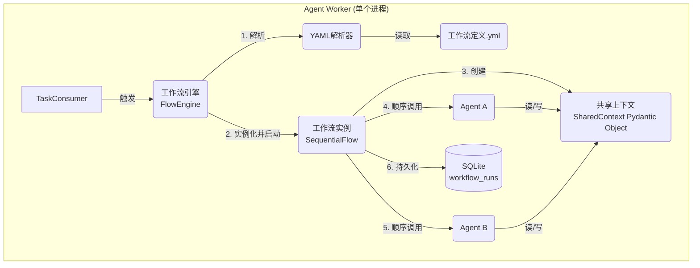

# MANDAS V2.0 - 系统架构设计文档 (SAD)

## 1. 文档概述

本文档在V1.3版本基础上进行更新，详细阐述了为单用户、单机环境优化的多代理协作框架的核心架构。V2.0的设计重点是在不引入分布式复杂性的前提下，实现强大、灵活的Agent编排能力。

## 2. 总体架构

V2.0的核心升级发生在Agent Worker服务内部，引入了FlowEngine作为顶层编排器。

## 3. 模块详细设计

### 3.1 FlowEngine (工作流引擎)

**职责**: Agent Worker内部的总控制器，负责接收任务、解析工作流定义、实例化并运行工作流。

**实现**: 一个Python类，内置一个简单的状态机（IDLE, RUNNING, COMPLETED, FAILED）。

**事件广播**: 采用观察者模式，在工作流的关键生命周期点（如flow_started, agent_started, agent_completed, flow_completed）发出事件，供日志和监控模块监听。

### 3.2 SharedContext (共享上下文)

**职责**: 在同一个工作流中的不同Agent之间传递数据和状态。

**实现**: 一个Pydantic模型，提供类型安全和数据校验。包含workflow_id, agent_results等字段，Agent通过set_result()和get_result()方法进行交互。

### 3.3 WorkflowParser (工作流解析器)

**职责**: 读取用户提供的YAML文件，根据工作流定义V1规范进行校验，并将其转化为Flow和Agent的内存对象。

### 3.4 数据库 (SQLite)

**职责**: 持久化工作流的定义和执行结果，实现零外部服务依赖。

**核心表 workflows**:
| 列名 | 类型 | 描述 |
|:---|:---|:---|
| id | VARCHAR | 工作流唯一ID |
| name | VARCHAR | 工作流名称 |
| description | TEXT | 描述 |
| definition_yaml | TEXT | 完整的YAML定义字符串 |
| version | INTEGER | 版本号 |

**核心表 workflow_runs**:
| 列名 | 类型 | 描述 |
|:---|:---|:---|
| id | UUID | 单次运行ID (run_id) |
| workflow_id | VARCHAR | 关联的工作流ID |
| status | VARCHAR | 运行状态 |
| initial_input | JSON | 初始输入 |
| final_output | JSON | 最终输出结果 |
| duration_ms | INTEGER | 总耗时 |
| started_at | TIMESTAMP | 开始时间 |

## 4. 核心设计原则

### 4.1 单机优化
- 所有组件运行在单个进程中
- 使用SQLite作为轻量级数据库
- 避免网络通信开销

### 4.2 类型安全
- 使用Pydantic进行数据模型定义
- 强类型的Agent接口
- YAML配置的严格校验

### 4.3 可扩展性
- 插件化的Agent架构
- 支持多种Flow类型（Sequential, Parallel, Conditional）
- 事件驱动的监控和日志系统

## 5. 性能考虑

### 5.1 内存管理
- SharedContext使用弱引用避免内存泄漏
- Agent执行结果的惰性加载
- 工作流执行历史的定期清理

### 5.2 并发处理
- 使用asyncio处理I/O密集型操作
- Agent内部支持异步执行
- 工作流级别的并发控制

## 6. 安全性

### 6.1 输入验证
- YAML配置的严格模式解析
- Agent参数的类型检查
- 文件路径的安全性验证

### 6.2 资源限制
- Agent执行时闸限制
- 内存使用监控
- 文件系统访问控制

## 7. 监控和日志

### 7.1 结构化日志
- 使用JSON格式的结构化日志
- 工作流执行的完整追踪
- Agent级别的性能指标

### 7.2 事件系统
- 工作流生命周期事件
- Agent执行状态变更
- 错误和异常的详细记录
